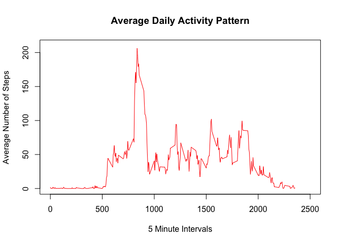
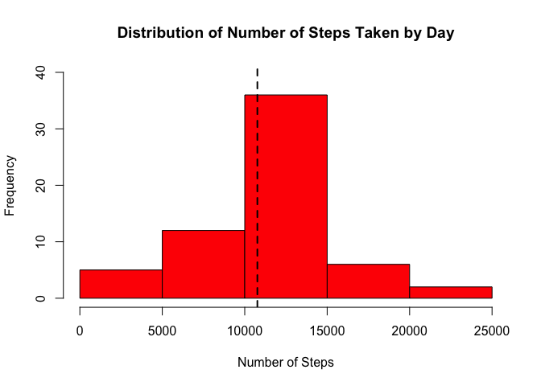

## Global Settings


## Loading and preprocessing the data

```
## 
## Attaching package: 'dplyr'
## 
## The following objects are masked from 'package:plyr':
## 
##     arrange, count, desc, failwith, id, mutate, rename, summarise,
##     summarize
## 
## The following objects are masked from 'package:stats':
## 
##     filter, lag
## 
## The following objects are masked from 'package:base':
## 
##     intersect, setdiff, setequal, union
## 
## 
## Attaching package: 'lubridate'
## 
## The following object is masked from 'package:plyr':
## 
##     here
```


```r
## Read csv file. Note: Data file is already in the same directory. Hence, no need to define path.
rawdataset <- read.csv("activity.csv", na.strings = "NA", stringsAsFactors = FALSE)

## Here we remove the NAs on the dataset to have a clean dataset
cleandataset <- na.omit(rawdataset)
```


## 1.- What is mean total number of steps taken per day?

```r
## Need to group data by day
grouped_by_day <- group_by(cleandataset, date)

## Calculate the total number of steps taken by day
q1_dataset <- summarise(grouped_by_day, stepsperday = sum(steps))

## Make a histogram of the total number of steps taken each day
hist(q1_dataset$stepsperday, col="red", main="Distribution of Number of Steps Taken by Day", xlab = "Number of Steps", ylab = "Frequency", ylim = c(0,30))

## Just for fun, we are adding the median to the histogram
abline(v=median(q1_dataset$stepsperday), lwd=2, lty=2)
```

 


```r
## Calculate and report the mean and median of the total number of steps taken per day

## Here we calculate the mean
mean_steps <- mean(q1_dataset$stepsperday)
```
The mean of the total number of steps is 10766.19


```r
## Here we calculate the median
median_steps <- median(q1_dataset$stepsperday)
```

The median is 10765.00

## 2. What is the average daily activity pattern?

```r
## First we need to group the data by 5 minute interval across all dates
grouped_by_interval <- group_by(cleandataset, interval)

## Then we need to get the mean of steps for each interval
average_activity <- summarise(grouped_by_interval, meanstepsbyinterval=mean(steps))

## Make a time series plot of the 5 minute interval (x-axis) and the average number of steps taken,
## averaged across all days (y-axis).
plot(average_activity$interval, average_activity$meanstepsbyinterval, type = "l", col="red", xlab = "5 Minute Intervals", ylab = "Average Number of Steps", xlim= c(0, 2500), ylim=c(0,210), main = "Average Daily Activity Pattern")
```

 


```r
## Which 5 minute interval, on average across all the days in the dataset, contains the maximum number of steps?

## First we need to find the maximum number of steps
max_steps <- max(average_activity$meanstepsbyinterval)
```
The maximum number of steps taken during any interval was 206.17


```r
## Then we need to find which 5 minute interval corresponds to the maximum number of steps
```


## 3. Imputing missing values

```r
## Calculate and report the total number of missing values in the dataset

## First we create a subset dataset which includes only observations with NAs values
onlynas <- subset(rawdataset, is.na(rawdataset))

## We count the number of observations for NAs
na_number <- count(onlynas)
```
The total number of missing values in the original dataset is 2304 observations.


```r
## A better strategy for filling all the missing values is to use the mean of the 5 minute interval
## We take the file we created before to capture the average number of steps by interval.
## Need to change the field name "meanstepsbyinterval" to "steps"", that way both datasets will 
## have the same field name for "interval".
average_activity <- select(average_activity, interval, steps = meanstepsbyinterval)

## Here we transfer the average values by interval, contained on the "average_activity" dataset
## to the "onlynas" dataset, as long as the "interval" number in both datasets matches.
## By doing this, we are effectively filling in the missing values with the mean across all dates
## for that interval.
onlynas$steps <- ifelse(onlynas$interval == average_activity$interval, average_activity$steps)

## Create a new dataset that is equal to the original dataset but with the missing data filled.

## Now we only need to do a row bind between the "cleandataset" (No NAs), with this updated dataset
newdataset <- rbind(cleandataset, onlynas)

## Make a histogram of the total number of steps taken each year

## Need to group data by day
by_day <- group_by(newdataset, date)

## Calculate the total number of steps taken by day
q3_dataset <- summarise(by_day, stepsperday = sum(steps))

## Make a histogram of the total number of steps taken each day
hist(q3_dataset$stepsperday, col="red", main="Distribution of Number of Steps Taken by Day", xlab = "Number of Steps", ylab = "Frequency", ylim = c(0,40))

## Just for fun, we are adding the median to the histogram
abline(v=median(q3_dataset$stepsperday), lwd=2, lty=2)
```

 


```r
## Calculate and report the mean and median total number of steps taken per day.
## Here we calculate the mean
mean_steps2 <- mean(q3_dataset$stepsperday)
```
The new mean is 10766.19


```r
## Here we calculate the median
median_steps2 <- median(q3_dataset$stepsperday)
```
The new median is 10766.19


```r
## Do these values differ from the estimates from the first part of the assignment?
mean_delta <- mean_steps2-mean_steps
median_delta <- median_steps2-median_steps
```
The difference in mean between the first measurement and the second is 0.00 steps.

The difference in median between the first measurement and the second is 1.19 steps.


```r
## What is the impact of imputing missing data on the estimates of the total daily number of steps?
```
The difference is negligible. After adding missing data we only saw an increase in the median by slightly more than 1 step. No major difference here.

## 4. Are there differences in activity patterns between weekdays and weekends?

```r
## "date"" field on "newdataset" is chr type. Need to change it to POSIXct type
newdataset$date <- ymd(newdataset$date)
```

