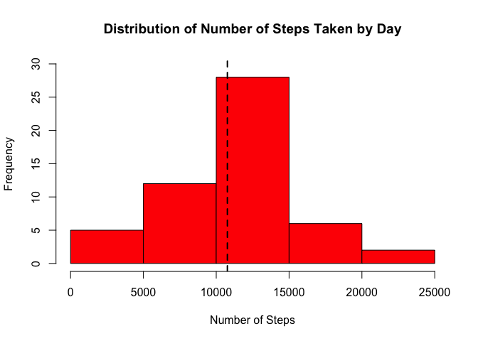
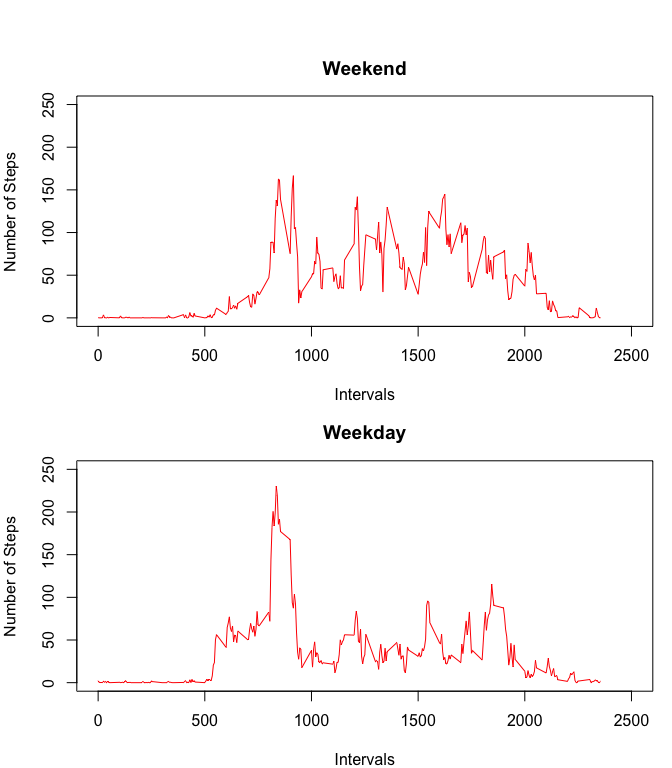

## Loading and preprocessing the data

```r
library(plyr)
library(dplyr)
library(lubridate)
```


```r
## Read csv file. Note: Data file is already in the same directory. Hence, no need to define path.
rawdataset <- read.csv("activity.csv", na.strings = "NA", stringsAsFactors = FALSE)

## Here we remove the NAs on the dataset to have a clean dataset
cleandataset <- na.omit(rawdataset)
```


## 1. What is mean total number of steps taken per day?

```r
## Need to group data by day
grouped_by_day <- group_by(cleandataset, date)

## Calculate the total number of steps taken by day
q1_dataset <- summarise(grouped_by_day, stepsperday = sum(steps))

## Make a histogram of the total number of steps taken each day
hist(q1_dataset$stepsperday, col="red", main="Distribution of Number of Steps Taken by Day", xlab = "Number of Steps", ylab = "Frequency", ylim = c(0,30))

## Just for fun, we are adding the median to the histogram
abline(v=median(q1_dataset$stepsperday), lwd=2, lty=2)
```

 


```r
## Mean
mean_steps <- mean(q1_dataset$stepsperday)
```
The mean is 10766.19


```r
## Median
median_steps <- median(q1_dataset$stepsperday)
```

The median is 10765.00

## 2. What is the average daily activity pattern?

```r
## First we need to group the data by 5 minute interval across all dates
grouped_by_interval <- group_by(cleandataset, interval)

## Then we need to get the mean of steps for each interval
average_activity <- summarise(grouped_by_interval, meanstepsbyinterval=mean(steps))

## Make a time series plot of the 5 minute interval (x-axis) and the average number of steps taken,
## averaged across all days (y-axis).
plot(average_activity$interval, average_activity$meanstepsbyinterval, type = "l", col="red", xlab = "5 Minute Intervals", ylab = "Average Number of Steps", xlim= c(0, 2500), ylim=c(0,210), main = "Average Daily Activity Pattern")
```

 


```r
## Which 5 minute interval, on average across all the days in the dataset, contains the maximum number of steps?

## First we need to find the maximum number of steps
max_steps <- max(average_activity$meanstepsbyinterval)
```
The maximum number of steps taken during any interval was 206.17


```r
## Then we need to find which 5 minute interval corresponds to the maximum number of steps
interval_max <- filter(average_activity, interval, meanstepsbyinterval==max_steps)
```

The 5 minute interval that corresponds to the maximum number of steps is 835

## 3. Imputing missing values

```r
## Calculate and report the total number of missing values in the dataset

## First we create a subset dataset which includes only observations with NAs values
onlynas <- subset(rawdataset, is.na(rawdataset))

## We count the number of observations for NAs
na_number <- count(onlynas)
```
The total number of missing values in the original dataset is 2304 observations.


```r
## A better strategy for filling all the missing values is to use the mean of the 5 minute interval
## We take the file we created before to capture the average number of steps by interval.
## Need to change the field name "meanstepsbyinterval" to "steps"", that way both datasets will 
## have the same field name for "interval".
average_activity <- select(average_activity, interval, steps = meanstepsbyinterval)

## Here we transfer the average values by interval, contained on the "average_activity" dataset
## to the "onlynas" dataset, as long as the "interval" number in both datasets matches.
## By doing this, we are effectively filling in the missing values with the mean across all dates
## for that interval.
onlynas$steps <- ifelse(onlynas$interval == average_activity$interval, average_activity$steps)

## Create a new dataset that is equal to the original dataset but with the missing data filled.

## Now we only need to do a row bind between the "cleandataset" (No NAs), with this updated dataset
newdataset <- rbind(cleandataset, onlynas)

## Need to group data by day
by_day <- group_by(newdataset, date)

## Calculate the total number of steps taken by day
q3_dataset <- summarise(by_day, stepsperday = sum(steps))
```


```r
## Make a histogram of the total number of steps taken each day
hist(q3_dataset$stepsperday, col="red", main="Distribution of Number of Steps Taken by Day", xlab = "Number of Steps", ylab = "Frequency", ylim = c(0,40))

## Just for fun, we are adding the median to the histogram
abline(v=median(q3_dataset$stepsperday), lwd=2, lty=2)
```

 


```r
## Mean
mean_steps2 <- mean(q3_dataset$stepsperday)
```
The new mean is 10766.19


```r
## Median
median_steps2 <- median(q3_dataset$stepsperday)
```
The new median is 10766.19


```r
## Do these values differ from the estimates from the first part of the assignment?
mean_delta <- mean_steps2-mean_steps
median_delta <- median_steps2-median_steps
```
The difference in mean between the first measurement and the second is 0.00 steps.

The difference in median between the first measurement and the second is 1.19 steps.


```r
## What is the impact of imputing missing data on the estimates of the total daily number of steps?
```
The difference is negligible. After adding missing data we only saw an increase in the median by slightly more than 1 step. 

We also saw an frequency increase in the number of steps interval between 10,000 and 15,000 steps. 

Other than that, there's no major difference here.

## 4. Are there differences in activity patterns between weekdays and weekends?

```r
## "date"" field on "newdataset" is chr type. Need to change it to POSIXct type
newdataset$date <- ymd(newdataset$date)

## Create a new factor variable in the dataset with two levels - "weekday" and "weekend",
## indicating whether a given date is a weekday or a weekend.

## First we need to identify the day of the week.
newdataset$dayweektype <- weekdays(newdataset$date)

## Filter those records where "dayweektype" is equal to "Saturday" or "Sunday"
weekend <- filter(newdataset, dayweektype == "Saturday" | dayweektype == "Sunday")

## Rename the content of "dayweektype" to "weekend"
weekend$dayweektype <- c("weekend")

## Filter those records where "dayweektype" is equal to "Monday" or "Tuesday" or "Wednesday" 
## or "Thursday" or "Friday"
workingweek <- filter(newdataset, dayweektype == "Monday" | dayweektype == "Tuesday" | dayweektype == "Wednesday" | dayweektype == "Thursday" | dayweektype == "Friday")

## Rename the content of "dayweektype" to "weekday"
workingweek$dayweektype <- c("weekday")
```
We ended up with two datasets: One for days of the week and another one for the weekends.


```r
## Data preparation for the panel plots

## Weekend - First we need to group the data by 5 minute interval across all dates
weekend_by_interval <- group_by(weekend, interval)

## Weekend - Then we need to get the mean of steps for each interval
weekend_activity <- summarise(weekend_by_interval, weekendstepsbyinterval=mean(steps))

## Weekday - First we need to group the data by 5 minute interval across all dates
workingweek_by_interval <- group_by(workingweek, interval)

## Weekday - Then we need to get the mean of steps for each interval
workingweek_activity <- summarise(workingweek_by_interval, weekstepsbyinterval=mean(steps))
```
Data is ready for the plots.


```r
## Make a panel plot of the 5 minute interval (x-axis) and the average number of steps taken,
## averaged across all weekday days or weekend days (y-axis).

## Set the global graphic parameters for all the plots
par(mfcol = c(2, 1), mar = c(4, 4, 3, 1), oma = c(0, 0, 2, 0))
## par(mfcol = c(2, 1))

## Create the Top plot
plot(weekend_activity$interval, weekend_activity$weekendstepsbyinterval, type = "l", col="red", xlab = "Intervals", ylab = "Number of Steps", xlim= c(0, 2500), ylim=c(0,250), main = "Weekend")

## Create the bottom plot
plot(workingweek_activity$interval, workingweek_activity$weekstepsbyinterval, type = "l", col="red", xlab = "Intervals", ylab = "Number of Steps", xlim= c(0, 2500), ylim=c(0,250), main = "Weekday")
```

 

### Are there differences in activity patterns between weekdays and weekends?
Most notably, the plots clearly indicate the amount of activity during the morning hours on weekends is considerably higher than on weekdays.
